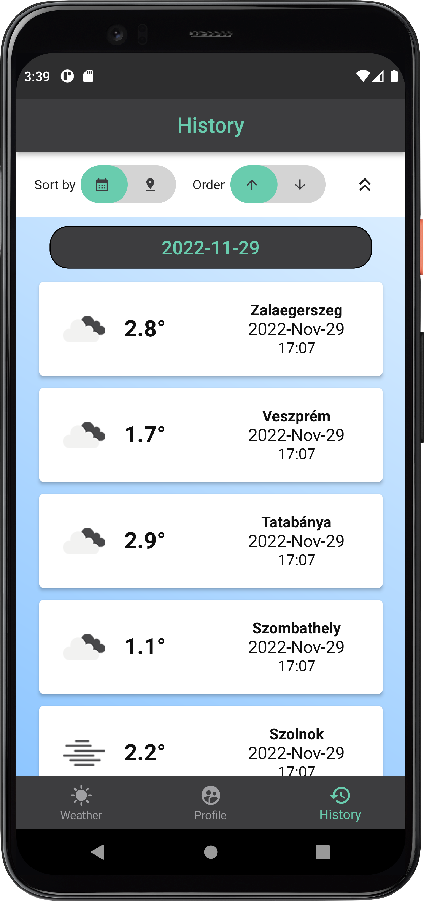

# WeatherNOW

`Flutter verseny házi feladat. (1. helyezés)`\
Az alkalmazás fő fejlesztési platformja az `Android` (min. lvl 30 API) volt de az alkalmazás fut `iOS` platformon is. Ezen kívül az alkalmazás `webes` (böngésző) platformon is használható. (tartalmaz a használhatósághoz szükséges reszponzivitást de a design alapvetően mobilra készült). Az alkalmazás magyar és angol nyelvre lett lokalizálva.

Az alkalmazást kipróbáltam a következő platformokon:
- Pixel 4 XL emulátor (android 10, LVL 30 API, fejlesztés alatt használt fő platform)
- Samsung Galaxy S20 FE (android 12)
- iPhone X szimulátor (iOS 15.5, Apple eszközök hiányában VM macOS)
- Chrome böngésző

## Bejelentkezés és regisztráció

Az alkalmazás használatához felhasználói fiókkal kell bejelentkezni. 

#### Belépés

A belépés az alkalmazásba a `felhasználónév` `jelszó` párossal történik.
Jelenleg az alkalmazásba két használható fiók van regisztrálva amelyek szabadon használhatóak.

| Felhasználónév        | Jelszó           | E-mail            | Szerep  |
| -------------         |------------------| ------------------|---------|
| TestAdminUser         | wasd123          | admin@test.hu     | admin   |
| TestSimpleUser        | 555555           |  simple@user.com  |   alap  |

A fenti felhasználókon kívül szabadon regisztrálhatunk új fiókokat is. Ezt a `Regisztráció` oldalon tehetjük meg.

#### Regisztráció

A regisztrációhoz a következő feltételeknek kell teljesülnie:
- Felhasználónév megadása ami még nem foglalt
- Jelszó megadása ami minimum 6 karakter hosszú
- Jelszó megismétlése
- Érvényes formátumú email megadása

Ezután (a könnyű tesztelés érdekében) lehetőség van megadni, hogy a felhasználó alapként vagy adminként legyen létrehozva.
Amennyiben a feltételek teljesültek visszajelzést kapunk arról, hogy sikeres volt-e a regisztráció. Sikeres regisztráció esetén egyből be is léptet az alkalmazás.
A megadott e-mail címnek csak formátum követelménye van nem kell hogy valós legyen mivel az e-mail hitelesítés és jelszó visszaállítás a levélszemetelés megelőzése érdekében ki van kapcsolva. :)

        

## Fő funkciók

#### Időjárás

Az időjárás tabon látható egy térkép amely szabadon mozgatható nagyítható. A térképen a beállított városok (jelen esetben megyeszékhelyek) helye meg van jelölve, és a város aktuális hőmérséklete, valamint az aktuális időjárást szimbolizáló ikon látható. A térkép alján (alsó tabbar felett) egy felnyitható listában is megtekinthetjük a városok aktuális időjárásait. A listából vagy a térképről egy várost kiválasztva megnyílik az adott város részletes időjárás adatait tartalmató oldal. Ez az oldal tartalmazza a következőket:
- Városnév
- Aktuális hőmérséklet
- Időjárás típusa és ikonja (esős, viharos stb.)
- Napi maximális hőmérséklet
- Napi minimális hőmérséklet
- Légköri nyomás
- Páratartalom
- Szél sebessége
- Felhőborítottság

Az időjárásadatok percenként frissülnek automatikusan.

        

## Profil

A profil oldalon látható az aktuálisan bejelentkezett felhasználói fiók adatai:
- Felhasználónév
- E-mail cím
- Fiók típus (alap, admin)

A fentieken kívül ezen az oldalon van lehetőség a hőmérséklet mértékegységének váltására `°C` és `°F` között (alapértelmezetten °C). A beállított érték az alkalmazáson bellül mindenhova érvényes és mentésre kerül, következő alkalmazás indításnán az értéket megőrzi.
A profil oldalon van lehetőség a fiókból való `kijelentkezésre` is. Kijelentkezés esetén visszakerülünk a bejelentkező oldalra.

        

## Előzmények 

Ez az oldal csak alap felhasználók számára érhető el. Itt az előzetesen elmentett időjárások megtekinthetőek lista formájában. A listát rendezhetjük dátum vagy város szerint, illetve csökkenő vagy növekvő sorrendben. Az admin felhasználóknál nem leátható ez az oldal viszont az alkalmazásban töltött idejük alatt percenként feltöltésre kerülnek a városok aktuális időjárás adatai.

        

## Forráskód

A forráskód eléréséhez kérlek keress meg e-mail-ben.

